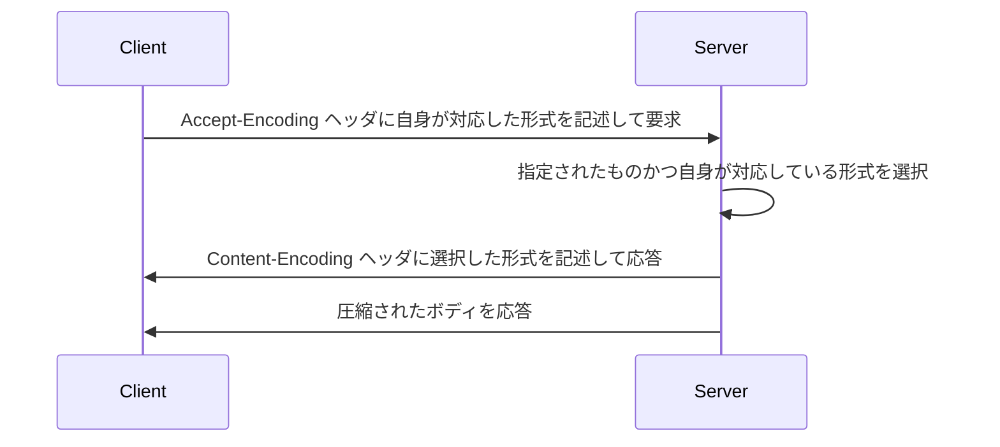
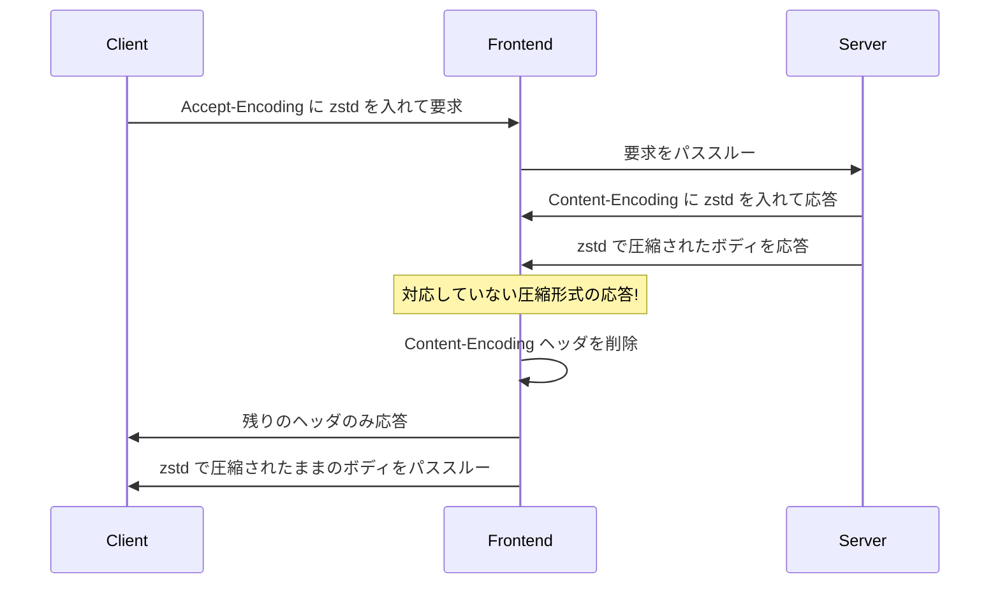

:::message
この記事は 2024 年 2 月 28 日に執筆されました．今後この問題が Cloud Run 側で修正された場合，再現しない可能性がありますのでご留意ください．
:::

## TL; DR

- Cloud Run は執筆時現在 zstd による圧縮に対応していない
- ヘッダの `Content-Encoding: zstd` のみが削除され，ボディは圧縮されたまま応答される
- ブラウザはこの応答を正しく解釈できないため文字化けのような表示となる
- zstd による圧縮は，執筆時現在 Chrome に実装されているもののデフォルトでは無効だが近い将来に有効化される

## 悲劇は突然訪れる

弊社では，コーポレートエンジニアリングチーム [^1] [^2] において，社内向けにいくつかのサービスを提供しています． これらのサービスはもともと AWS でホストされていましたが，アクセス制限に Identity-Aware Proxy を使いたいこと，マネージド RDB の最小インスタンスが安いこと，ステージング環境を不要なときに 0 インスタンスまでスケールインできること，などを理由にして Google Cloud，とくに Cloud Run への移行を行いました．

[^1]: https://notion.yumemi.co.jp/%E3%82%B3%E3%83%BC%E3%83%9D%E3%83%AC%E3%83%BC%E3%83%88%E3%82%A8%E3%83%B3%E3%82%B8%E3%83%8B%E3%82%A2%E3%83%AA%E3%83%B3%E3%82%B0
[^2]: https://qiita.com/fuwasegu/items/98f57f7305649463f7da

Cloud Run への移行は順調に完了し，通常通りの提供を続けていました．しかし，ある日突然次のようなスクリーンショットとともに社内サービスを利用できない旨の報告があったのです:


画像の通りレスポンスが完全に文字化けしており，正しく表示できていません．文字化けと聞くと最初に浮かぶのはエンコーディングの不一致ですが，典型的な文字化け列と特徴が一致しませんし，実際にダンプしたレスポンスをみても文字エンコーディングの違いによるものではないと考えられました．

## 原因特定を妨げる 2 つの悪魔

原因の切り分けと特定を行っていくに当たって，2 つの悪魔に襲われることになります．

### この問題を経験したのは社内でたった 2 名

問題が起きたサービスは社内のメンバであれば誰もが利用するようなものでした．しかしながら，この問題に気づいて報告したのは合わせてたった 2 名だったのです．しかも，最初に報告があったときは 1 名のみでした．3 ヶ月以上立ってから，2 人目からの報告がありました．

1 人目の報告があった際には，原因の特定に至りませんでした．暫定対応として， Chrome のデータディレクトリを完全に削除した上で再インストールをしてもらいました．これによって正常にアクセスできるようになったため，事象は迷宮入りしかけていました．

問題が手元で再現できないときほど，切り分けや特定が難しいことはありません．私たちだけではなく，問題の報告者自身も能動的に原因特定を行っていなければ，いまだに問題は解決していなかったかもしれません．

### Chrome のレスポンスダンプがついた嘘

私たちは報告者から提供されたレスポンスのダンプを基に原因究明を進めていました．その中で，オクテット列の中に `EF BF BD` が頻出していることに気づいたのです．これは UTF-8 における `U+FFFD` (UNICODE REPLACEMENT CHARACTER) と呼ばれ，UTF-8 としてパースしようとした際に不正だったオクテット列を置き換えた状態だったのです．

Chrome の Dev Tools では HAR 形式でレスポンスをダンプすることができますが，これに問題があり，生のレスポンスとは違うものになっていました [^3]．報告者が自らこれに気づいたことで，事態は進展しました．

[^3]: https://twitter.com/biochem_fan/status/1532313814255157248

結局，生のレスポンス内容をみるために，Charles [^4] をプロキシとして使うことでトラヒックの内容を除くことができました．そして得られた生のレスポンスボディが以下でした:

[^4]: https://www.charlesproxy.com/


私たちはすぐにマジックバイトを探しました． `28 B5 2F FD` は Zstandard フレームのマジックバイトと一致したのです [^5]．ダンプしたオクテット列を Zstandard アーカイブとして伸長すると，見慣れた HTML が表示されました．

[^5]: https://github.com/facebook/zstd/blob/dev/doc/zstd_compression_format.md#zstandard-frames

## Cloud Run は zstd 圧縮に対応していない

HTTP において，やりとりするデータ量を削減するためにレスポンスボディを圧縮することがあります．これらの圧縮は Web サーバが，伸長はブラウザが自動的に行い，最近では主に次のような圧縮形式が利用されます:

- Gzip (gzip) [^6]
- Brotli (br) [^7]
- Zstandard (zstd) [^8]

このうち Gzip と Brotli については何も問題はありませんでした．実際に，ほとんどのブラウザ環境ではこのどちらかが利用され，ほとんどの利用者は問題に遭遇していませんでした．Brotli については 2020 年に対応していない旨の報告があったもののすでに対応されています [^9]．

[^6]: https://datatracker.ietf.org/doc/html/rfc9110#section-8.4.1.3
[^7]: https://datatracker.ietf.org/doc/html/rfc7932#section-13
[^8]: https://datatracker.ietf.org/doc/html/rfc8878.html#section-7.2
[^9]: https://issuetracker.google.com/issues/147185337

しかし，今回問題となった Zstandard については，執筆時現在において，Cloud Run はまだこれに対応していなかったのです [^10]．対応していないだけであれば，Gzip または Brotli が利用されるだけなので問題はないはずですが，Cloud Run では適切なフォールバックが行われないため，今回のような事象となりました．

[^10]: https://issuetracker.google.com/issues/147185337

圧縮を利用するためにはサーバとブラウザの両者がその形式に対応している必要があるため，以下のようなシーケンスでやりとりが行われます:



Cloud Run においては，サーバとブラウザが直接やりとりをするわけではなく，Google Frontend サーバを経由します．このとき，今回の問題が発生する環境においては以下のようなやりとりが行われていました:



この結果，ブラウザが受け取るのは `Content-Encoding` が削除されたものの肝心のボディは圧縮されたままの応答なので，正常にパースできずに失敗します．

Cloud Run が **以下のいずれかの実装をしていれば** 問題は起きませんでした:

1. Zstandard に対応する
2. Accept-Encoding で指定された形式のうち自身が対応していないものを削除してサーバに要求
3. 返ってきた Content-Encoding が対応していない形式でもヘッダを削除しない

## ラッキー? それともアンラッキー?

原因特定はできました．しかし，なぜ一部の Chrome 環境でしか再現しなかったのでしょうか．Zstandard 自体は高圧縮率かつ高速な圧縮形式として比較的広く知られていて，GitHub Actions などでも利用されている [^11] ものの，実は HTTP における圧縮はまだまだ普及していません．

[^11]: https://github.com/actions/cache/blob/v2/README.md#:~:text=Increased%20performance%20and%20improved%20cache%20sizes%20using%20zstd%20compression%20for%20Linux%20and%20macOS%20runners

Chrome Platform Status で見てみると， Zstd Content-Encoding はバージョン 123 からデフォルトで有効になるオプションで，バージョン 118 からはフラグで有効にすることができる機能でした [^12]．

[^12]: https://chromestatus.com/feature/6186023867908096

報告者の環境においてこのフラグが有効になった経緯は不明ですが，通常の利用では執筆時現在はまだ有効になっていない機能であるため，特定の環境でのみ再現する現象であることは説明がつきます．また，Chrome のデータディレクトリを削除して再インストールすることで解決した例についても，そこにフラグの設定が含まれていたためにそれがリセットされて解決したと仮定すると辻褄があいます．

バージョン 122 へのアップデート直後に発生したとの報告もあるので，一部の環境にのみ選考してロールアウトされているのかもしれません．

このまま順調にリリースされたとすると，バージョン 123 は 2024 年 3 月 14 日にリリースされる予定のため，対応を行っていなかったらこの日にいきなり大量の報告が来たことが予想されるでしょう．今のうちに気づいて対処できたのはラッキーだったのかもしれません．

## 対処法

結論から言えば，私たちは zstd 圧縮を一旦無効化することにしました．Cloud Run が対応したのを確認したら，また有効化する予定です．このサービスは FrankenPHP [^13] でホストしていたため，これに含まれる Caddy [^14] の設定を少し変えるだけで済みました．

[^13]: https://frankenphp.dev/
[^14]: https://caddyserver.com/

```diff
http:// {
-   encode zstd br gzip
+   encode br gzip
}
```

## 再現実験

今回の事象を再現する方法を以下に示します．

:::message
Cloud Run が Zstandard に対応していない前提での説明です．今後対応された場合はこの実験ができません．
:::

1. 以下の Caddyfile と Dockerfile を作成します．

   :::message
   デフォルトでは 512 バイト未満のレスポンスは圧縮されませんが，実験しやすいように 1 バイトから圧縮するようにしておきます．
   :::

   ```text:Caddyfile
   http:// {
       encode zstd gzip {
           minimum_length 1
       }
       respond "Hello, world!"
   }
   ```
   
   ```dockerfile:Dockerfile
   FROM caddy:2.7-alpine
   COPY ./Caddyfile /etc/caddy/Caddyfile
   ```

2. 適当な Artifact Registry リポジトリを作成して，ビルドしたイメージをプッシュします．

   :::message
   Apple Silicon など，非 x86 環境で作業をする方は `--platform linux/amd64` を忘れずにつけてください．Cloud Run 上のコンテナは AMD64 で動作します．
   :::

   ```shell
   gcloud artifacts repositories create zapp --location=asia-northeast1 --repository-format=docker
   gcloud auth configure-docker asia-northest1-docker.pkg.dev
   docker buildx build --push --platform linux/amd64 -t asia-northeast1-docker.pkg.dev/<project_id>/zapp/zapp:latest .
   ```

3. 新規 Cloud Run サービスを作成してデプロイします．

   ```shell
   gcloud run deploy zapp --image=asia-northeast1-docker.pkg.dev/<project_id>/zapp/zpp:latest --region=asia-northeast1 --port=80 --allow-unauthenticated
   ```

4. Gzip 圧縮を要求すると `Content-Encoding: gzip` ヘッダとともに Gzip 圧縮された応答が返ってくることを確認します．

   ```shell
   curl -H 'Accept-Encoding: gzip' -v https://zapp-xxxxxxxx.a.run.app/ 2 >&1 | grep -i content-encoding
   # < content-encoding: gzip
   
   curl -H 'Accept-Encoding: gzip' https://zapp-xxxxxxxx.a.run.app/ | gunzip
   # Hello, world!
   ```

5. Zstandard 圧縮を要求すると `Content-Encoding` ヘッダが **削除された状態で** Zstandard 圧縮された応答が返ってくることを確認します．

   ```shell
   curl -H 'Accept-Encoding: zstd' -v https://zapp-xxxxxxxx.a.run.app/ 2 >&1 | grep -i content-encoding
   # (一致なし)
   
   curl -H 'Accept-Encoding: zstd' https://zapp-xxxxxxxx.a.run.app/ | unzstd
   # Hello, world!
   ```

これで再現ができました．
